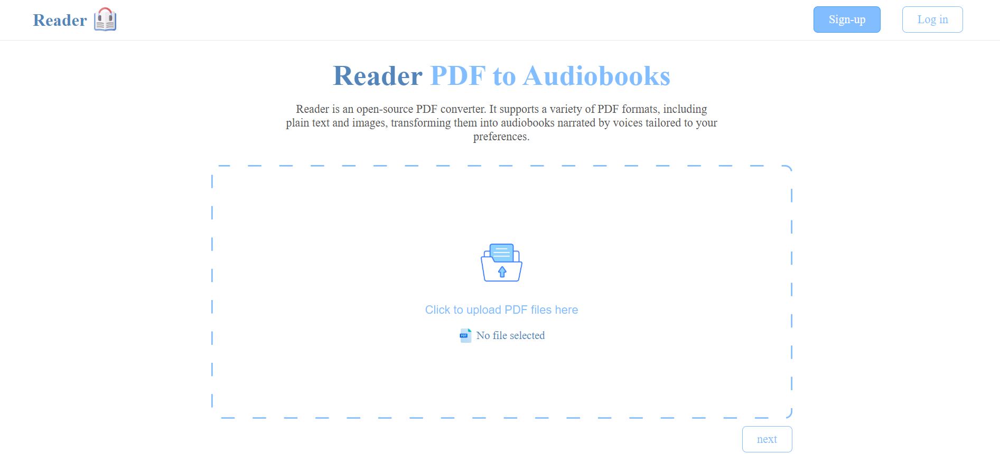

# Reader
Reading is fundamental, fun to mental no pun intended 😏. Reader is an open source audio book generator that aims to make reading fun to mental.  It supports PDF books with both text and image based and converts them to high quality audio files stored at user google drive. Since audio conversion is a resource expensive operation, Reader will inform users with the completion through their Gmail accounts.

# Tools
- **React** (front-end) 
- **Flask** (API)
- **Pdf2Image** (Image conversion)
- **Pytesseract** (text extraction)
- **Google drive** (file storage)
- **Gmail** (user notification)
- **Azure TTS** (voice generation)
  
# How to run the project?
To clone and use the project effectively, follow these steps.

1. Run the command, it will download all the dependencies for the project to run. The **requirements.txt** exists in the backend folder  
```python
pip install -r requirements.txt
```

2. Install both  **Pytesseract** and  **Pdf2Image** and add them to your env file
```env
PYSTESSERACT_PATH=YOUR OCR LIBRARY PATH

POP_PATH=YOUR POP IMAGE CONVERTOR LIBRARY PATH
```

**Note: for both steps 3, 4 you will need to have an account on GCP, you can use your student account to sign-in, make sure you enable both API's the Drive and Gmail on your project follow any tutorial you like for this.**

3. Create a **service account** to use google drive API you can follow any video make sure the type of you are using a **JSON** key, then add its path in the env file.
```env
SERVICE_ACCOUNT_FILE=YOUR GOOGLE SERVICE ACCOUNT JSON KEY FILE PATH   
``` 

4. Create an **Auth key** to use Gmail and then generate the **ACCESS_KEY** from the Auth consent screen and add it to the env file along side the **CLIENT_ID** and **CLIENT_SECRET** from your GCP account. 
	**Note: at the time of creating this project supports only Auth to use Gmail API**. 
```env
CLIENT_ID=YOUR GMAIL CLIENT ID

CLIENT_SECRET=YOUR GMAIL CLIENT SECRET

ACCESS_KEY=YOUR GMAIL SECRET KEY
```

5. Similar to  GCP, create an account at **AZURE** to use their TTS service and add the subscription key and service region to the env file, which you will get after configuring **Azure Cognitive service**
```env
AZURE_TTS_SUBSCRIPTION_KEY=YOUR AZURE SUBSCRIPTION KEY

AZURE_SERVICE_REGION=AZURE TTS REGION
```

6. Run the server using this command in the terminal of **VS Code**, It will start the **Flask** API dev server make sure your at the root **backend** folder
```terminal 
python app.py
```

7. Run the React App using this command in the terminal of **VS Code**, it will start the **React** server make sure your at the root of **frontend** folder
```terminal
npm run
```
# Future Enhancements 
This is the first prototype, the following are further enhancements to be included in the next release.
- **Text Extraction**: segmenting the extracted text to chapters.
- **Audio Conversion**: efficient logic to convert multiple segments to audio (Azure batch processing, multi=threading)
- **UI Elements**: narrator selection card enchantments.
# References
Many references were used during the development of **Reader** here we highlight the significant once.
- **Chatgbt**: CSS enhancements,  code conundrums solving
- **Azure TTS**: documentation and github code samples
- **Google Drive, Gmail**: Documentations
# Acknowledgments 
Special thanks for **Dr.Khalid Alherbi** for his guidance through the semester.


